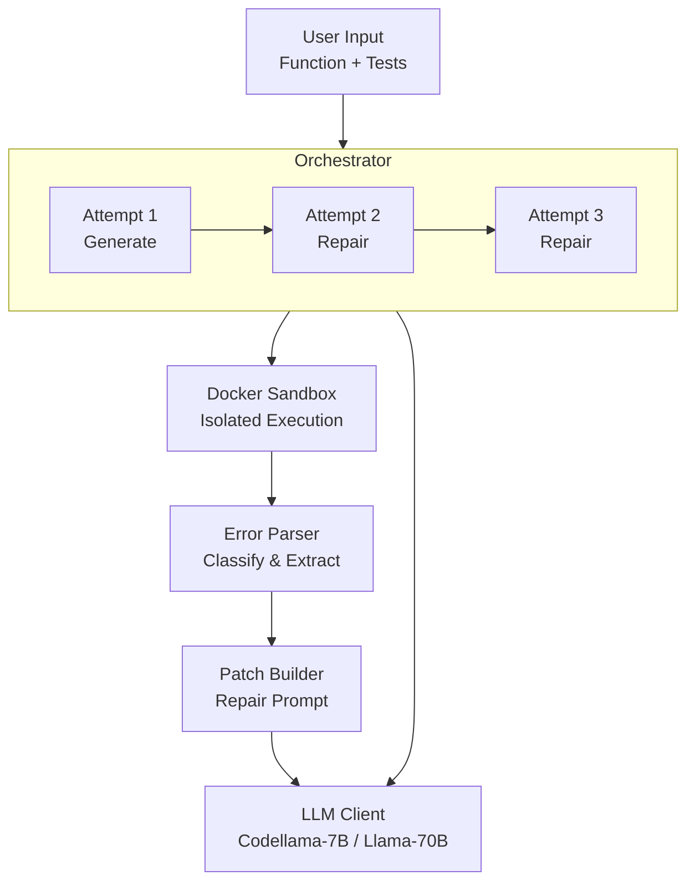
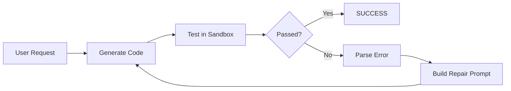
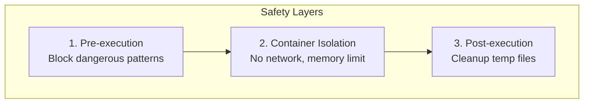

# System Architecture

## High-Level Overview

## Data Flow

## Safety Architecture

## Component Responsibilities

| Component | File | Purpose |
|-----------|------|---------|
| Orchestrator | `src/loop/orchestrator.py` | Controls retry loop, tracks attempts |
| Ollama Client | `src/llm/ollama_client.py` | Local LLM inference |
| Groq Client | `src/llm/groq_client.py` | Cloud LLM inference |
| Docker Runner | `src/sandbox/docker_runner.py` | Safe code execution |
| Guardrails | `src/sandbox/guardrails.py` | Malicious code detection |
| Error Parser | `src/loop/error_parser.py` | Error classification |
| Patch Builder | `src/loop/patch_builder.py` | Repair prompt construction |
| Benchmarks | `src/eval/benchmarks.py` | HumanEval/MBPP loading |
| Runner | `src/eval/runner.py` | Evaluation CLI |
| Metrics | `src/eval/metrics.py` | Pass@k calculation |

## Sandbox Security

| Layer | Protection |
|-------|------------|
| Pre-execution | Block os.system, eval, exec, file ops, network |
| Container | --network=none, --memory=512m, --timeout=15s |
| User | Non-root testrunner user |
| Cleanup | Remove temp files, kill container |