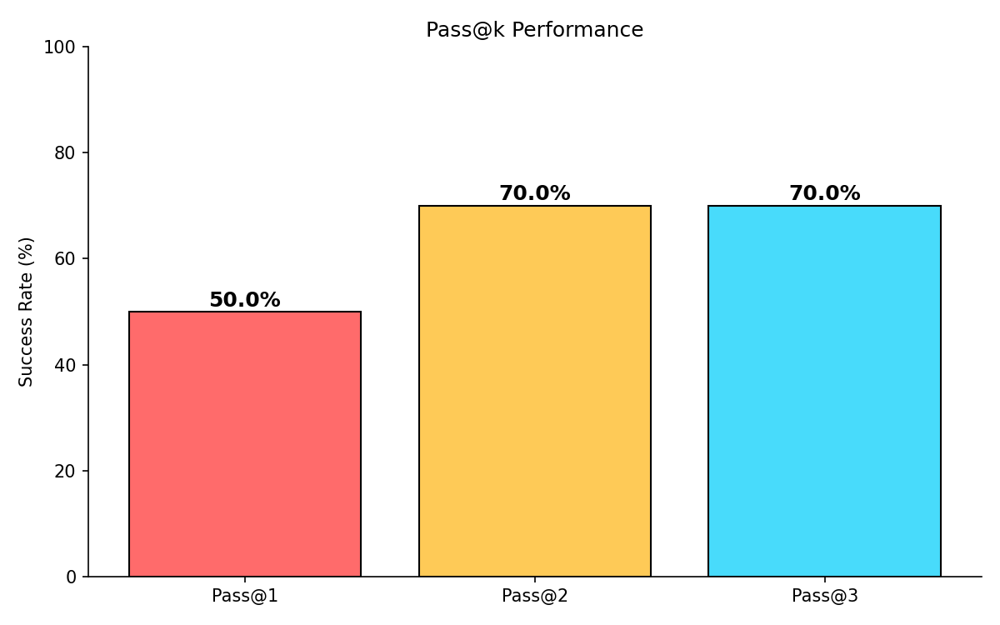

# Self-Correcting Code Generator

## Demo

🎬 **[Success on First Attempt](https://youtu.be/0FOmyAHn6MM)** - System generates correct code immediately

🎬 **[Self-Correction in Action](https://youtu.be/f7LQSIX9pi8)** System detects error, fixes code on retry

A system that generates Python code using local LLMs, tests it in Docker sandboxes, and automatically fixes errors through iterative feedback.



## Results

### HumanEval Benchmark

| Metric | Codellama-7B | Llama-70B |
|--------|--------------|-----------|
| Pass@1 | 60.0% | 90.0% |
| Pass@3 | 70.0% | 90.0% |
| Improvement | 16.7% | 0.0% |
| Avg Time | 27.3s | 1.7s |

**Key Finding:** Self-correction benefits weaker models more. The 7B model improved 16.7% while the 70B model (already at 90%) showed no improvement.

### MBPP Benchmark

| Metric | Value |
|--------|-------|
| Pass@1 | 30.0% |
| Pass@3 | 40.0% |
| Improvement | 33.3% |

## How It Works

1. LLM generates code from function description
2. Code runs in isolated Docker container with pytest
3. If tests fail, error is parsed and fed back to LLM
4. LLM attempts to fix the code (up to 3 attempts)
5. Step-by-step reasoning prompts guide the model

## Setup
```bash
# Clone
git clone https://github.com/hasinisirigari/code-self-corrector.git
cd code-self-corrector

# Create virtual environment
python -m venv venv
venv\Scripts\Activate  # Windows
source venv/bin/activate  # Linux/Mac

# Install dependencies
pip install -r requirements.txt

# Pull the model
ollama pull codellama:7b

# Build Docker image
docker build -f docker/runner.Dockerfile -t code-runner:latest .
```

## Usage

### Web App
```bash
streamlit run app.py
```

### CLI Evaluation
```bash
# Run on HumanEval
py -m src.eval.runner --dataset humaneval --limit 30 --output runs/results.json

# Run on MBPP
py -m src.eval.runner --dataset mbpp --limit 30 --output runs/results.json

# Generate report and charts
py -m src.eval.reports runs/results.json
py -m src.eval.charts runs/results.json

# Compare models (requires GROQ_API_KEY)
py -m src.eval.compare_models --limit 10
```

## Project Structure
```
├── app.py                 # Streamlit web app
├── src/
│   ├── llm/              # Ollama + Groq clients
│   ├── sandbox/          # Docker runner, safety checks
│   ├── loop/             # Orchestrator, error parser
│   └── eval/             # Benchmarks, metrics, charts
├── docker/               # Dockerfile for sandbox
├── reports/              # Generated charts and reports
└── runs/                 # Evaluation results
```

## Tech Stack

- **LLM**: Ollama + Codellama-7B (local), Groq + Llama-70B (cloud)
- **Sandbox**: Docker with resource limits
- **Benchmarks**: HumanEval, MBPP
- **Frontend**: Streamlit

## Safety

- Docker containers have no network access
- 512MB memory limit, 15s timeout
- Malicious code patterns blocked before execution
- Non-root user in container

## Error Analysis

| Error Type | Occurrence | Fix Rate |
|------------|------------|----------|
| LOGIC | 85% | 12.5% |
| SYNTAX | 10% | 0% |
| TYPE | 5% | 0% |

Logic errors dominate but are hardest to fix, suggesting future work on including expected outputs in repair prompts.

## License

MIT